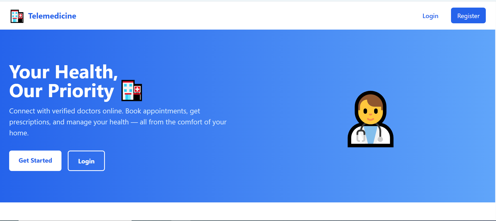
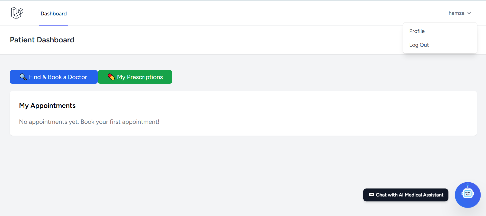
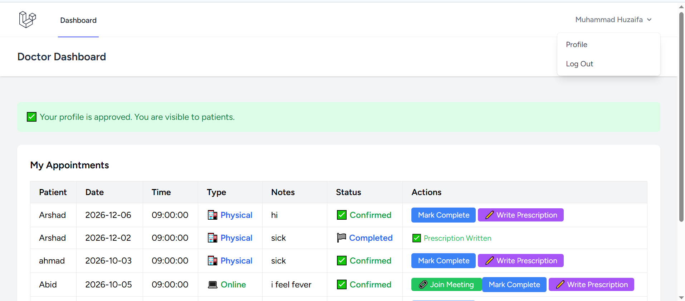
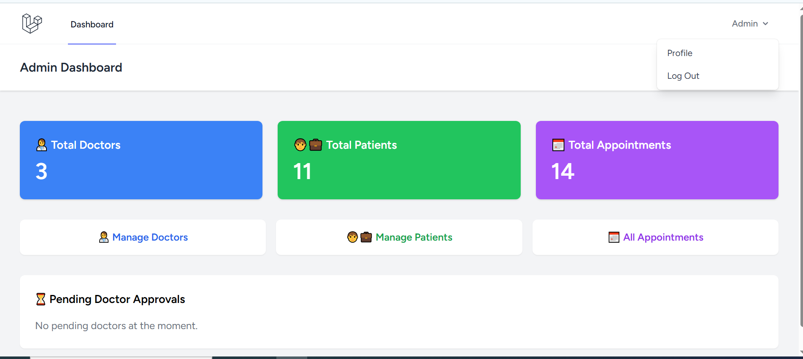

# Telemedicine

A Laravel-based telemedicine platform for coordinating patients, doctors, and administrators in one system. The application supports appointment booking, doctor profile approval, prescription management, reminders, email notifications, and role-based dashboards.

## Screenshots

Add your project screenshots to a folder such as `docs/screenshots/` and link them here.









## Features

- Patient, doctor, and admin role-based access.
- Patient dashboard for browsing doctors, searching doctors, booking appointments, and viewing prescriptions.
- Doctor dashboard for confirming, canceling, and completing appointments.
- Doctor profile submission flow for approval by the admin.
- Admin dashboard for approving/rejecting doctors, viewing users, appointments, and managing blocked accounts.
- Prescription creation and delivery workflow.
- Appointment reminder tracking and email notifications.
- Optional AI chat route for patient support.

## Tech Stack

- Laravel 11
- PHP 8.2+
- MySQL or SQLite
- Vite
- Tailwind CSS
- Alpine.js

## Requirements

- PHP 8.2 or higher
- Composer
- Node.js 18+ and npm
- A database server such as MySQL, MariaDB, PostgreSQL, or SQLite

## Installation

1. Clone the repository.

```bash
git clone https://github.com/TahaXCoder/Telemedicine.git
cd Telemedicine
```

2. Install PHP dependencies.

```bash
composer install
```

3. Install frontend dependencies.

```bash
npm install
```

4. Create your environment file and generate an application key.

```bash
cp .env.example .env
php artisan key:generate
```

5. Configure your `.env` file.

Set your database connection, application URL, and mail settings before running the app. If you are using Mailtrap or another email provider, update the mail driver values accordingly.

6. Run the database migrations.

```bash
php artisan migrate
```

7. Build the frontend assets.

```bash
npm run build
```

For local development, you can use the Vite dev server instead:

```bash
npm run dev
```

## Running The Application

Start the Laravel development server:

```bash
php artisan serve
```

Then open the app in your browser using the URL shown in the terminal, usually `http://127.0.0.1:8000`.

## User Roles

### Patient

- View available doctors.
- Search doctors.
- Book appointments.
- View prescriptions.
- Use the patient AI chat endpoint.

### Doctor

- Create and manage a doctor profile.
- Confirm, cancel, and complete appointments.
- Add meeting links.
- Create prescriptions for completed appointments.

### Admin

- Approve or reject doctor registrations.
- View doctors, patients, and appointments.
- Block users when needed.

## Main Routes

- `/patient/dashboard`
- `/patient/doctors`
- `/patient/book/{doctorId}`
- `/doctor/dashboard`
- `/doctor/profile/create`
- `/admin/dashboard`
- `/admin/doctors`
- `/admin/patients`
- `/admin/appointments`

## Project Structure

- `app/Http/Controllers` contains the role-specific controllers.
- `app/Models` contains the core application models.
- `database/migrations` defines the telemedicine schema.
- `resources/views` contains the Blade templates.
- `routes/web.php` defines the main patient, doctor, and admin routes.

## Email And Notifications

The project includes several mailable classes for appointment and doctor workflow updates, including booking confirmations, appointment reminders, prescription readiness, and doctor approval notifications.

## Deployment Notes

Before deployment:

- Set production values in `.env`.
- Run `php artisan migrate --force` on the production database.
- Build assets with `npm run build`.
- Configure your mail and queue drivers.
- Cache configuration and routes if needed for production.

## Contributing

Pull requests and improvements are welcome. If you add new features, update the README and screenshots so the project stays easy to understand.

## License

This project is open-sourced software licensed under the MIT license.
